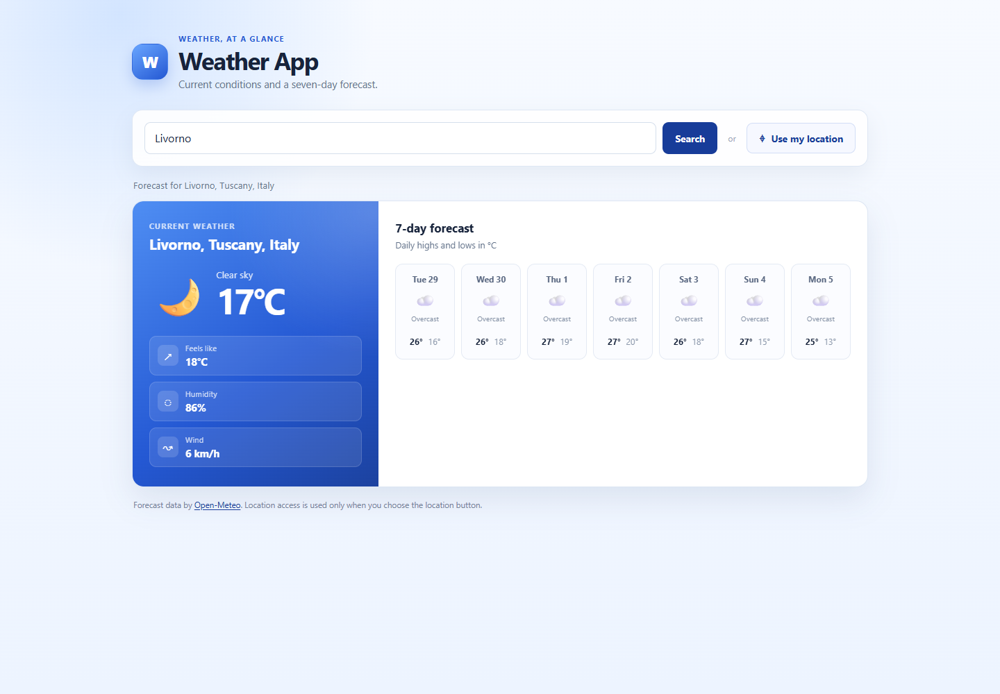

# Weather App

A small weather dashboard for looking up a city or checking the forecast for your current location. It uses the Open-Meteo APIs and is built with plain HTML, CSS, and JavaScript.

## Features

- Search for a city and view its current conditions.
- Show a seven-day forecast with daily highs and lows.
- Request browser location access only when the user chooses it.
- Handle missing cities, API failures, and location permission errors with clear messages.
- Use the layout on desktop and mobile screens.

## Run locally

1. Clone this repository or download the project files.
2. Open `index.html` in a modern browser.

No package installation or build command is required. Browser geolocation works on secure contexts such as HTTPS and localhost; some browsers block it when the page is opened directly from disk.

## Data and APIs

- [Open-Meteo Geocoding API](https://open-meteo.com/en/docs/geocoding-api) finds the city coordinates.
- [Open-Meteo Forecast API](https://open-meteo.com/en/docs) provides current conditions and the daily forecast.
- The browser's Geolocation API provides coordinates only after the user requests location access and grants permission.

The app does not store or transmit a location beyond the weather request needed to show the forecast.

## Project files

- `index.html` contains the search form and forecast regions.
- `style.css` contains the responsive interface.
- `script.js` contains API requests, loading and error states, and forecast rendering.

## Built with

HTML · CSS · JavaScript · Fetch API · Open-Meteo
